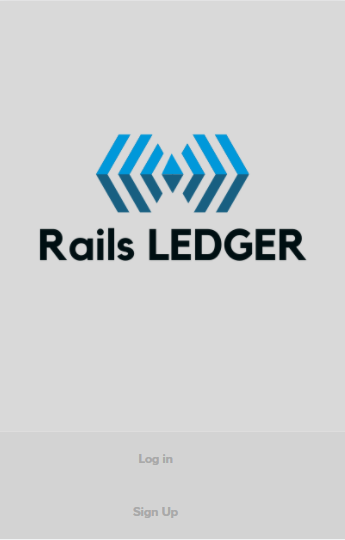
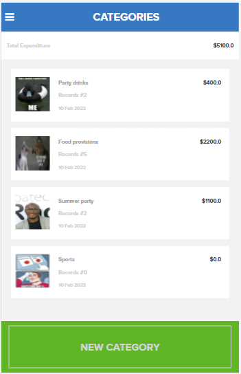

# RailsLedger
A mobile web application where you can manage your budget: you have a list of transactions associated with a category, so that you can see how much money you spent and on what.
## Built With
- Ruby version 3.0.3
- RoR version 7.0.2

## Live Demo
- [Click Me!](https://shielded-wave-68335.herokuapp.com/ )
## Getting Started

**The project comes shipped with linters config for ruby, so ensure you have Rubocop**
**installed in your local environment**

- **Ensure you have postgresql, nodejs, ruby and rails set up on your machine**
- **To get a local copy of the repository please run the following commands on your terminal:**
- **$ git clone https://github.com/see-why/RailsLedger.git**
- **$ run `bundle install` to couple all dependacies in gem files**
- **$ run `npm install` to couple all dependacies in package.json files**
- **$ run `rspec spec/models` to run application models unit tests**
- **$ run `rspec spec/requests` to run application controllers unit tests, remember to remove authenticate_user! from the controllers first**
- **$ run `rspec spec/integrtion` to run application integration tests**
- **$ run `rails s` to start rails server**
## Database creation
Run rails db:create db:migrate

P.S : if you are coming from a previous version, you might want to delete the database by running rails db:drop (run with caution as all data will be lost)

## Mails from Devise Gem

To view generated mails, for links to change password and confirm emails, check terminal logs.

👤 **Cyril Iyadi**

- GitHub: [@see-why](https://github.com/see-why)
- LinkedIn: [C.Iyadi](https://www.linkedin.com/in/cyril-iyadi/)

## 🤝 Contributing

Contributions, issues, and feature requests are welcome!

Feel free to check the [issues page](../../issues/).

## Show your support

Give a ⭐️ if you like this project!

## Acknowledgments
- Design by [Gregoire Vella on Behance](https://www.behance.net/gregoirevella)
- my dog Bubbles for the comforting lick here and there
## 📝 License
- This project is [MIT](./LICENSE) licensed.
